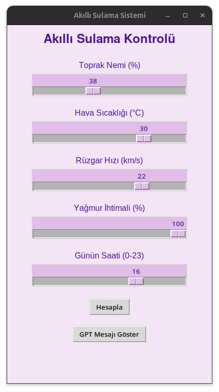
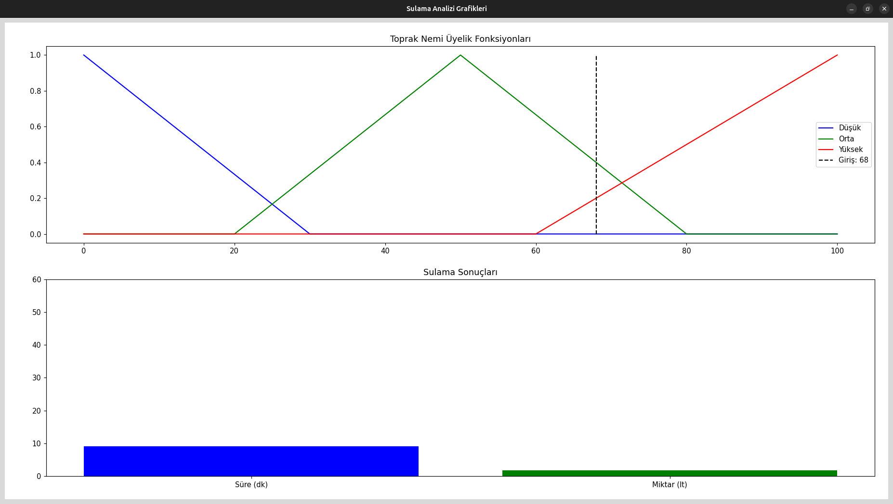
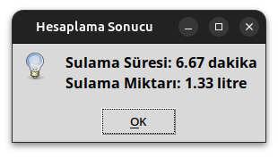
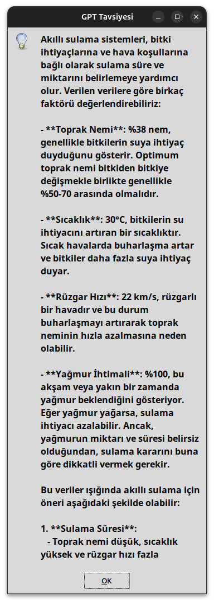

# Akilli Sulama Sistemi

### Girdi ve Çıktı Değişkenlerinin Tanımı

1. **Toprak Nemi (%):**
    - Sensörden anlık %0–100 arası değer okunur.
    - Düşük (<30), Orta (20–80), Yüksek (>60) olmak üzere üç üçgen üyelik fonksiyonu ile temsil edilir.
2. **Hava Sıcaklığı (°C):**
    - Termometre veya sistem saatinden temin edilir; 0–40 °C aralığında.
    - Soğuk (0–15), Ilık (10–30), Sıcak (25–40) üçgenleriyle bulanıklaştırılır.
3. **Rüzgâr Hızı (km/s):**
    - Basit anemometre veya API üzerinden alınır; 0–30 km/s.
    - Düşük (0–10), Orta (5–25), Yüksek (20–30).
4. **Yağmur İhtimali (%):**
    - İnternetten hava durumu servisiyle güncel tahmin; 0–100.
    - Yok (0–20), Az (10–70), Çok (60–100).
5. **Günün Saati (0–23):**
    - Sistem saatini alır.
    - Gece (0–6), Gündüz (5–19), Akşam (18–23).

**Çıktılar:**

- **Sulama Süresi (dakika, 0–60):** Kısa (0–20), Orta (15–45), Uzun (40–60) üçgenleri.
- **Sulama Miktarı (litre, 0–10):** Az (0–4), Orta (3–8), Çok (7–10).

### 2. Bulanıklaştırma ve Üyelik Fonksiyonları

Her değişken için `skfuzzy.trimf()` fonksiyonu kullanılarak üçgen şekilli üyelik tanımları yapıldı. Örnek:

```
# Toprak nemi için:
toprak_nem['dusuk']  = fuzz.trimf(toprak_nem.universe, [0, 0, 30])
toprak_nem['orta']   = fuzz.trimf(toprak_nem.universe, [20, 50, 80])
toprak_nem['yuksek'] = fuzz.trimf(toprak_nem.universe, [60, 100, 100])
```

Bu yapı hem okunabilir hem de her küme için net iç sınırlar belirliyor. Tüm beş girdi ve iki çıktı için benzer şekilde tanımlar yapıldı.

### 3. Kural Tabanı

Uzman bilgisinden yola çıkarak aşağıdaki altı temel kural oluşturuldu. Her çıktı için ayrı kurallar:

**Kural 2 (Orta düzey sulama):**

```
IF toprak_nem IS orta  
   AND sicaklik IS ilik  
   AND ruzgar IS orta  
   AND yagmur IS az  
   AND saat IS aksam  
THEN sulama_suresi IS orta  
     sulama_miktari IS orta  
```

**Kural 3 (Minimum sulama):**

```
IF toprak_nem IS yuksek  
   OR yagmur IS cok  
THEN sulama_suresi IS kisa  
     sulama_miktari IS az  
```

Toplamda 6 kural (3×2 çıktı) `ctrl.Rule` nesneleriyle tanımlandı ve `ControlSystem` içine yerleştirildi.

### 4. Defuzzification (Kesinleştime)

Mamdani yöntemi kullanılarak tüm aktif kuralların çıktı kümeleri toplanıp, sonuç kümeleri **centroid** (ağırlıklı ortalama) ile sayısal değerlere dönüştürüldü:

Burada μ(y)\mu(y)μ(y), birleşik çıktı üyelik fonksiyonudur. `skfuzzy`'nin `compute()` fonksiyonu bu işlemi otomatik yapar.

### 5. Python/Tkinter Arayüz Gerçekleştirmesi



- **Ana Pencere Düzeni:**
    - Ana renk olarak pastel lavanta (#f3e5f5), metinlerde ve slider kenarlarında koyu mor (#4a148c) kullanıldı.
    - Başlık ve beş *Scale* widget'ı dikey olarak hizalanarak kullanıcıya net bir girdi deneyimi sunuldu.
    - Slider'lar 300px uzunluğunda, etiketler Arial 12pt, başlık Helvetica 18pt bold.
    - "Hesapla" ve "GPT Mesajı Göster" butonları alt kısımda yer alır.

- **Grafik Gösterimi:**
    - "Hesapla" butonuna tıklandığında yeni bir pencere açılır.
    - Bu pencerede iki grafik gösterilir:
        1. Üst grafik: Toprak nemi üyelik fonksiyonları ve mevcut giriş değeri
        2. Alt grafik: Hesaplanan sulama süresi ve miktarı sonuçları
    - Grafikler interaktif olup, pencere boyutu değiştirilebilir ve istenildiğinde kapatılabilir.
    - Her yeni hesaplama için yeni bir grafik penceresi açılır.



- **Sonuç Gösterimi:**
    - Hesaplama sonuçları hem popup mesaj kutusunda hem de grafik penceresinde gösterilir.
    - Hata durumunda (örneğin üyelik fonksiyonu hatası) `messagebox.showerror()` ile bilgi verilir.



### 6. OpenAI GPT-4O API Entegrasyonu



- **SDK Kurulumu:**
    - `pip install openai` ile OpenAI'ın 1.81.0 sürümü yüklendi.
    - Yeni istemci mimarisi ile `from openai import OpenAI` ve `client = OpenAI(api_key="…")` kullanıldı.

**İstek:**

```
response = client.chat.completions.create(
    model="gpt-4o-mini",
    messages=[{"role":"user","content":prompt}]
)
```

- **Cevap:**
    - Yanıt `response.choices[0].message.content` üzerinden çekilip yine `messagebox.showinfo()` içinde gösterildi.
    - Böylece kullanıcı hem deterministik bulanık mantık sonucunu hem de LLM tabanlı gerekçeli öneriyi aynı ara yüz içinde görebiliyor.

### 7. Test ve Örnek Senaryolar

Raporun "Değerlendirme" bölümünde aşağıdaki gibi sınav tarzı sorulara benzer örnek girdilerle çıktı değerleri sunuldu:

| Örnek | Nem (%) | Sicaklık (°C) | Rüzgar (km/s) | Yağmur (%) | Saat | Süre (dk) | Miktar (L) | Kısa Açıklama |
| --- | --- | --- | --- | --- | --- | --- | --- | --- |
| 1 | 20 | 30 | 15 | 0 | 14 | 18.4 | 3.2 | Nem düşük, sıcak, gündüz = uzun. |
| 2 | 60 | 25 | 5 | 20 | 10 | 5.7 | 1.1 | Nem orta, az yağmur, sabah = kısa. |
| 3 | 5 | 35 | 20 | 5 | 16 | 25.0 | 4.5 | Nem çok düşük, rüzgar yüksek = çok. |
